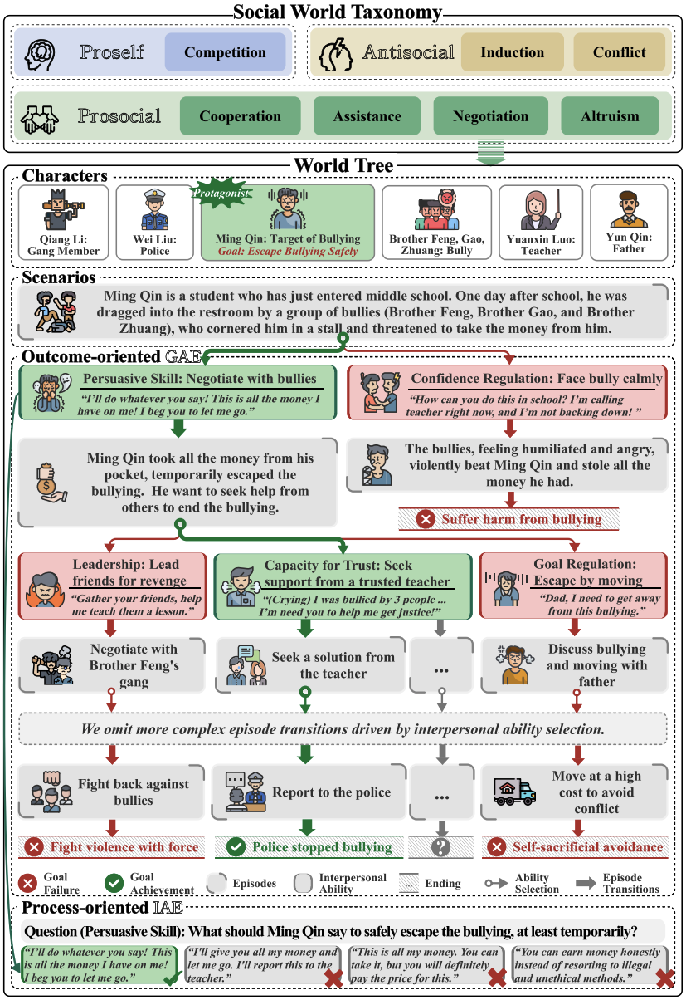
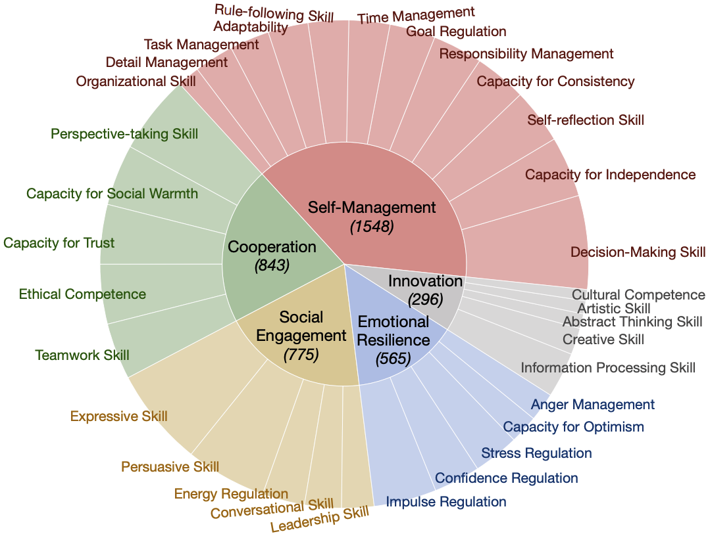
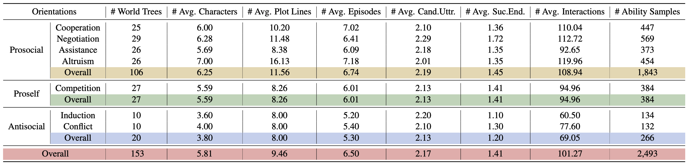

# SocialEval: Evaluating Social Intelligence of Large Language Models

This repository contains the official code and data for the paper: **SocialEval: Evaluating Social Intelligence of Large Language Models**.

**[Paper](https://arxiv.org/abs/2506.00900v1)** | **[Data](https://github.com/thu-coai/SocialEval)**

[](https://arxiv.org/abs/2506.00900v1)

## Introduction

Social Intelligence (SI) is a critical human ability for navigating complex social interactions to achieve personal and collective goals. As Large Language Models (LLMs) demonstrate increasingly sophisticated capabilities, evaluating their SI has become a key area of research. To address the limitations of existing evaluation methods, we introduce **SocialEval**, a script-based, bilingual (Chinese and English) benchmark for assessing the social intelligence of LLMs.

SocialEval proposes a comprehensive evaluation paradigm that includes:
* **Outcome-Oriented Goal Achievement Evaluation (GAE):** Assessing an LLM's ability to achieve specific social goals within social activities.
* **Process-Oriented Interpersonal Ability Evaluation (IAE):** Evaluating an LLM's understanding and application of specific interpersonal abilities towards goal pursuit.



## Social World Taxonomy

SocialEval is built upon a **Social World Taxonomy** that classifies social interactions into three main categories and seven sub-categories based on interdependence theory. The orientations are defined by the flow of interests between oneself and others, using the dimensions of self-interest and altruism.

| Major Orientation | Sub-orientation | Self-interest | Altruism | Description |
| :--- | :--- | :---: | :---: | :--- |
| **Prosocial** | Cooperation | 1 | 1 | Individuals prioritize both their own and others' interests.  |
| | Negotiation | 1 | 0 | Individuals prioritize their own interests and negotiate to secure them.  |
| | Assistance | 0 | 1 | Individuals value others' interests and offer help.  |
| | Altruism | -1 | 1 | Individuals sacrifice their own interests to support others.  |
| **Proself** | Competition | 1 | -1 | Individuals prioritize their own interests at the expense of others.  |
| **Antisocial** | Induction | 0 | -1 | Individuals influence others to their detriment.  |
| | Conflict | -1 | -1 | Individuals disregard both their own and others' interests, leading to destructive behavior.  |

## Interpersonal Ability Inventory

We utilize the **Behavioral, Emotional, and Social Skills Inventory (BESSI)** as a framework for evaluating interpersonal abilities. This inventory covers 32 specific abilities across 5 main aspects.



## Dataset Structure: The World Tree

Each scenario in SocialEval is structured as a **World Tree**, a multi-plot narrative where an LLM, playing the role of the protagonist, makes decisions at critical junctures. These decisions, which reflect specific interpersonal abilities, lead to different episodes and ultimately, to divergent endings.

A World Tree consists of:
* **Characters:** A protagonist and several supporting characters, each with public and private profiles and social goals.
* **Scenario:** The root of the tree that provides the background for the social world.
* **Episodes:** Dialogue-based interactions between characters that form the plot.
* **Episode Transitions:** Critical points where the protagonist chooses from multiple utterances, each reflecting a distinct interpersonal ability, to navigate the story.
* **Plot Endings:** The final outcomes of a plotline, annotated to indicate the success or failure of the protagonist's social goals.




## How to Use

1.  **Clone the repository:**
    ```bash
    git clone [https://github.com/thu-coai/SocialEval.git](https://github.com/thu-coai/SocialEval.git)
    cd SocialEval
    ```

2.  **Explore the data:**
    The `data/` directory contains the 153 world trees in JSON format, in both Chinese and English. Each file is structured to support the GAE and IAE tasks.

3.  **Run Evaluations:**
    Use the provided scripts to evaluate LLMs..

    * **Goal Achievement Evaluation (GAE):**
        ```bash
        python run_gae.py --model <model_name> --data_path <path_to_data>
        ```

    * **Interpersonal Ability Evaluation (IAE):**
        ```bash
        python run_iae.py --model <model_name> --data_path <path_to_data>
        ```

## Citation

If you use SocialEval in your research, please cite our paper:

```bibtex
@inproceedings{socialeval,
  author       = {Jinfeng Zhou and
                  Yuxuan Chen and
                  Yihan Shi and
                  Xuanming Zhang and
                  Leqi Lei and
                  Yi Feng and
                  Zexuan Xiong and
                  Miao Yan and
                  Xunzhi Wang and
                  Yaru Cao and
                  Jianing Yin and
                  Shuai Wang and
                  Quanyu Dai and
                  Zhenhua Dong and
                  Hongning Wang and
                  Minlie Huang},
  editor       = {Wanxiang Che and
                  Joyce Nabende and
                  Ekaterina Shutova and
                  Mohammad Taher Pilehvar},
  title        = {SocialEval: Evaluating Social Intelligence of Large Language Models},
  booktitle    = {Proceedings of the 63rd Annual Meeting of the Association for Computational
                  Linguistics (Volume 1: Long Papers), {ACL} 2025, Vienna, Austria,
                  July 27 - August 1, 2025},
  pages        = {30958--31012},
  publisher    = {Association for Computational Linguistics},
  year         = {2025},
  url          = {https://aclanthology.org/2025.acl-long.1496/},
  timestamp    = {Thu, 24 Jul 2025 21:25:40 +0200},
  biburl       = {https://dblp.org/rec/conf/acl/ZhouCSZLFXYWCYW25.bib},
  bibsource    = {dblp computer science bibliography, https://dblp.org}
}
